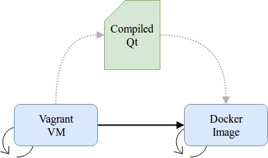

This tool creates a docker image with compiled Qt. Qt is compiled in VM (vagrant+vbox).

### How it works?
1. It creates Vagrant (VBox) virtual machine (based on Ubuntu 16.04), installs deps and builds Qt mingw.
2. It creates docker image with compiled Qt deployed into it.

### How to run it?
- `sudo ./build.sh`
- or use described steps from this script
